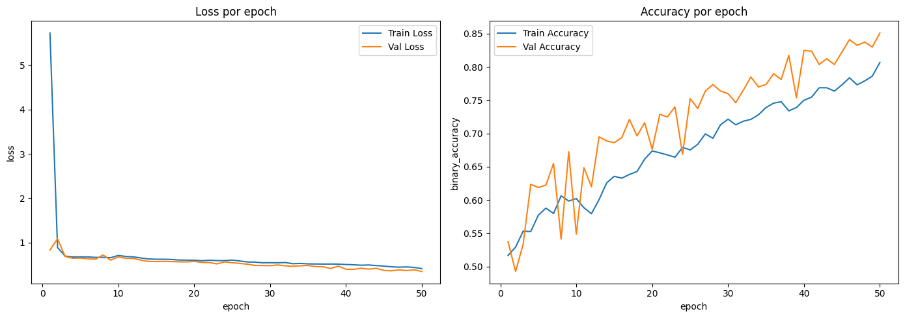
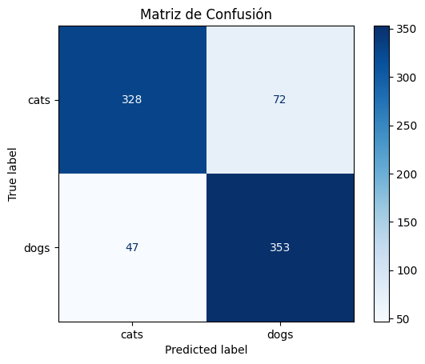

# 🐶 Clasificador de Perros y Gatos con Deep Learning

Este proyecto implementa un modelo de clasificación de imágenes para distinguir entre **perros** y **gatos** usando redes neuronales convolucionales (CNN), desarrollado como parte del Bootcamp de Data Science en Hack a Boss.

Incluye una **app interactiva en Streamlit** para probar el modelo directamente con imágenes externas:

👉 [Probar el clasificador en Streamlit](https://streamlit.app/tu-enlace-aqui) 👈

---

## ⚙️ Iteraciones realizadas

A lo largo del desarrollo, se han llevado a cabo 5 iteraciones de mejora progresiva:

| Iteración         | Cambios clave                                                                 |
|-------------------|-------------------------------------------------------------------------------|
| Modelo Inicial    | Arquitectura simple, imágenes 128x128, sin regularización.                    |
| Iteración 1       | Más capas `Conv2D`, `Dropout`, más filtros, y `EarlyStopping` afinado.       |
| Iteración 2       | Aumento de datos más agresivo (`imgaug`).                                     |
| Iteración 3       | Aumento de tamaño de imagen a 224x224.                                        |
| Iteración 4       | Rediseño total con 4 bloques CNN, `BatchNormalization` y capa densa ampliada.|

---

## 📊 Comparativa de resultados

| Métrica    | Modelo Inicial | Iteración 1 | Iteración 2 | Iteración 3 | Iteración 4 |
|------------|----------------|-------------|-------------|-------------|-------------|
| Accuracy   | 0.7575         | 0.8088      | 0.8212      | 0.5550      | **0.8512**  |
| Precision  | 0.7655         | 0.8095      | 0.8067      | 0.5683      | **0.8306**  |
| Recall     | 0.7425         | 0.8075      | 0.8450      | 0.4575      | **0.8825**  |
| F1-Score   | 0.7538         | 0.8085      | 0.8254      | 0.5069      | **0.8558**  |

✅ **Iteración 5** logró el mejor rendimiento global.

---

## 🖼️ Visualización

### Gráficas de entrenamiento (Loss & Accuracy)


### Matriz de confusión


---

## 🧪 Demo: Clasificación en tiempo real

Puedes subir una imagen desde tu ordenador (JPG o PNG) y el modelo predirá si se trata de un **perro** o un **gato**, junto con el porcentaje de certeza.

### 🎯 Accede a la demo aquí:

[https://streamlit.app/tu-enlace-aqui](https://streamlit.app/tu-enlace-aqui)

---

## 📁 Estructura del proyecto

```
├── app_clasificador.py               # App Streamlit
├── models/                           # Modelos entrenados .keras
├── notebooks/                        # Desarrollo y pruebas
├── data/                             # Datos originales
├── historys/                         # Historias de entrenamiento
├── metrics.png                       # Gráfica de métricas
├── confusion_matrix.png              # Matriz de confusión
├── requirements.txt                  # Requisitos del proyecto
└── README.md                         # Este archivo
```

---

## 🧱 Requisitos

Instalación rápida:

```bash
pip install -r requirements.txt
```

Y para lanzar la app:

```bash
streamlit run app_clasificador.py
```

---

## 🧠 Conclusiones

- El diseño de una buena arquitectura **desde cero** es posible sin transfer learning.
- Las mejoras más relevantes vinieron de:
  - Aumentar la profundidad de la red,
  - Regular correctamente con `Dropout` y `BatchNormalization`,
  - Usar imágenes de **mayor resolución**.
- El uso de `imgaug` para **data augmentation agresivo** fue clave para evitar sobreajuste.
- La app en Streamlit permite validar el modelo de forma sencilla con nuevas imágenes.

Este proyecto demuestra cómo mejorar progresivamente un modelo CNN básico hasta lograr un rendimiento robusto en una tarea de clasificación binaria realista.

---

**💡 Desarrollado por: Alejandro G.Herrera**
**🎓 Proyecto de práctica – Hack a Boss Bootcamp**
